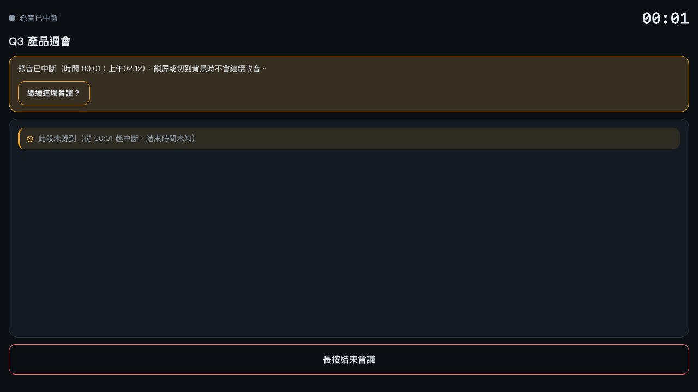
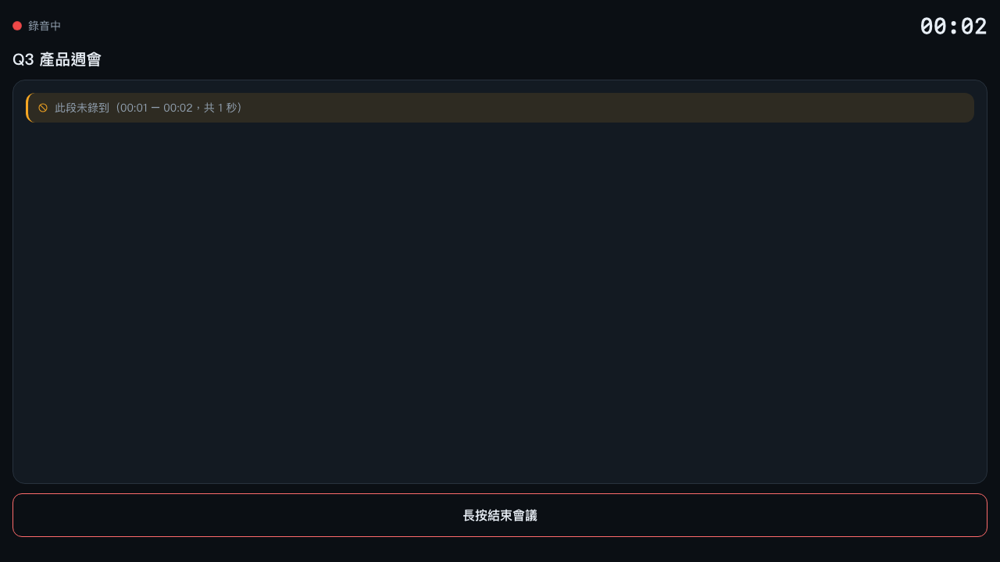

# M01-US-107 交付：背景／鎖屏缺口標記（`TRANSCRIPT_GAP`）

> Backlog：[M01-US-107](../backlog.md) ｜ AC：[docs/ac/M01-US-107.md](../ac/M01-US-107.md) ｜ 設計：[docs/design/M01-US-107-transcript-gap.md](../design/M01-US-107-transcript-gap.md)
> Module：M01（聽：收音與即時逐字稿）｜ 日期：2026-10-09 ｜ 模式：trust mode（SOP v2.0 完整流程）

## 1. 這一票到底解決了什麼

失敗模式 **F22 靜默缺段**：切到背景或鎖屏時，瀏覽器會停掉麥克風。回到前台後畫面一切正常、
錄音紅燈又亮了，但**中間那 3 分鐘的音檔與逐字稿根本不存在**——而且沒有人說。

這一票不做「把音補回來」（那是 US-106 原生層），只做**誠實標記**：

- 切到背景／鎖屏**當下**就寫下一筆缺口（不等到回前台才寫，否則被系統殺掉就永遠不知道有缺口）；
- 逐字稿上顯示「此段未錄到（12:03 – 15:41，共 3 分 38 秒）」；還沒結束的缺口明說「結束時間未知」；
- 同一次中斷只留一列（iOS webview 會重複送 `visibilitychange`），續錄後再中斷是新的一列；
- 缺口長度 = **真的中斷了多久**（牆鐘），不是畫面計時器的那個數字（中斷時它刻意凍結）。

## 2. AC 對照與證據

| AC | 內容 | 證據（哪裡看得到） |
| -- | ---- | ------------------ |
| AC-1 | 中斷當下就寫入缺口（含開始時間），不等回前台 | E2E `gap-marking.spec.ts` AC-1；`gap-tracker.test.ts`「hidden 當下立刻有一筆未閉合缺口」 |
| AC-2 | 逐字稿顯示「此段未錄到」＋時間範圍；未閉合要說「結束時間未知」 | E2E AC-2／AC-3；`gap-text.test.ts`（6）；`transcript-gap-row.test.ts`（元件層）；截圖見 §3 |
| AC-3 | 同一次中斷只一列（重複 `hidden` 不得遞增 seq）；續錄後新的中斷＝新的一列 | E2E「重複 hidden 不重複標」＋「兩次中斷兩列」；worker `transcript-gap-routes.test.ts` 重複寫入 `duplicate:true` 且列數不變 |

### DoD 對照

- [x] 離線不丟（本機先落地、之後補送；被殺掉重開由 `syncPendingGaps()` 掃 `localStorage` 補送）
- [x] 時間範圍以伺服端權威時間軸為準（缺口長度讀 `RecorderStore.wallClockElapsedMs`，見 D10）
- [x] 探針含正向與負向兩類斷言
- [x] 伺服端拒絕不合法範圍（`GAP_INVALID` 400）與「未開始／已結束／上限到點」（409）
- [x] `REGRESSION_MODULE=M01` 全綠

## 3. 驗收指令與結果（實際貼上）

```
# UI 單元（18 檔）
$ npx vitest run
 Test Files  18 passed (18)
      Tests  166 passed (166)

# UI 端到端（真的 wrangler dev + 真的瀏覽器；每一步都同時驗伺服端帳本）
$ npx playwright test
  25 passed (33.5s)        # gap-marking 9、iphone-viewport 3、meeting-recording 8、recovery 5

# worker（15 檔）
$ cd worker && npm run test
 Test Files  15 passed (15)
      Tests  169 passed (169)

# Gate 2：型別 + 樣式 + 圖示守門
$ npm run typecheck     → svelte-check found 0 errors and 0 warnings
$ npm run lint          → 0 errors 0 warnings；守門 PASS（46 檔 · 程式碼用到 3 個圖示 chat/mic/ban）
$ cd worker && npm run lint && npm run typecheck   → markdownlint 53 檔 0 issues；tsc 無輸出

# Gate 3：回歸探針
$ npm run regression            → 131 passed | 35 skipped（M01 相關全跑）
$ cd worker && npm run regression → [regression-guard] ✅ 通過
```

### 截圖（真的跑出來的畫面）





畫面文字（規格層，取自同一次跑動的 DOM）：

```
OPEN   ROW: 此段未錄到（從 00:01 起中斷，結束時間未知）
CLOSED ROW: 此段未錄到（00:01 – 00:02，共 1 秒）
伺服端帳本（GET /m/:id/transcript/gaps）: [{seq:1, fromMs:1032, toMs:2589}]   ← 差 1557ms ≈ 真的中斷時間
```

> 截圖是用 `__tf.notifyVisibility(true/false)` 驅動**同一條正式程式碼**（`app.svelte.ts` 的 `notifyVisibility`）
> 拍的，不是在測試裡另外寫一套邏輯。

## 4. 誠實聲明：**沒有**被驗到的部分

| 沒驗到的事 | 為什麼 | 現在的替代證據 |
| ---------- | ------ | -------------- |
| **真機 iOS 鎖屏 / Android 螢幕關閉** | CI 的 Chromium 不會真的鎖屏；`visibilitychange` 的觸發在測試裡是人工呼叫 | 人工呼叫走的是**同一條** `notifyVisibility` 路徑（含 `willInterrupt` 判斷），程式碼路徑相同、觸發源不同 |
| **webview 在背景被系統殺掉** | Playwright 無法在「頁面已死」後再觀察行為 | 本機先落地 + 重開掃描（`syncPendingGaps`）已有單元與 E2E 覆蓋（「離線待同步」那條）；「殺掉後重開」這一步仍未被端到端驗證 |
| **真的語音辨識（STT/ASR）** | worker 以 `HARNESS_PROVIDER:faux` 跑，沒有真的模型 | 本票不碰辨識；缺口是逐字稿的**條目**，與文字來源無關（US-103/104 會接上） |
| **畫面時間與真實中斷長度的誤差** | 缺口長度以牆鐘毫秒為準，但畫面顯示向下取整到秒 | 顯示的頭尾時間與長度**用同一個取整基準**（`formatClock` + `floor`），所以同一列自洽：`00:01 – 00:02，共 1 秒` |
| **極端時鐘漂移（> 60 秒）** | 伺服端容差是 60 秒（D5），沒有真的去撥裝置時鐘 | worker 測試有 `GAP_INVALID` 邊界（超過容差會被 400 拒收） |
| **圖片內容本身** | 產出本文件時的主要模型**看不到圖** | 兩張截圖另外交給 vision 子代理檢視（`deepseek-v4-flash-vision-exp`）並逐字轉錄，未被指出渲染問題 |

## 5. 與審查（Gate 4）的關係

`dev-checker-loop` 跑了兩個**獨立**的唯讀 reviewer（`pi-reviewer` + `claude-code`），
收到 5 條有效發現，**全部修完才提交**。這裡只列「修了什麼、怎麼證明它真的壞過」：

| # | 級別 | 問題 | 修法 | 證明（紅→綠） |
| - | ---- | ---- | ---- | ------------- |
| F1 | **P0** | 回到前景（`visibility_visible`）就關缺口 → 但 `state.ts` 刻意**不自動續錄**，此刻錄音還是中斷的；加上 `snapshot.elapsedMs` 在中斷時凍結，缺口被寫成 **0 秒**，而且之後續錄也救不回來（已閉合、不可縮短） | 關缺口只由「真的回到錄音／結束會議／上限關閉」觸發（D9）；長度改讀 `wallClockElapsedMs`（D10） | E2E「回到前景未續錄時缺口不得被提前關掉」：突變回舊行為 → `data-gap-open` 意外是 `false`（紅）；修好 → 綠。另加接縫測試 `gap-tracker-store.test.ts` 的反面教材 |
| F2 | P1 | 衝突列合併時「伺服端 `fromMs` ＋ 本機 `toMs`」各取一半，會拼出兩邊都沒有的區間，甚至 `toMs < fromMs` | 衝突時整筆採伺服端那份，且任何合併都夾 `toMs ≥ fromMs`（D12） | 單元「整筆用伺服端那份」：突變回舊寫法 → `"fromMs": 20000, "toMs": 9100`（紅）；修好 → 綠 |
| F3 | P1 | 衝突列在畫面上沒有任何提示（設計 §5／D8 要求「與伺服端不一致」） | `TranscriptGapRow.svelte` 加 `data-testid="gap-conflict"`（與伺服端不一致）與 `gap-terminal`（僅存本機） | 元件測試新增 2 條（衝突、terminal） |
| F4 | P1 | 缺「store × tracker」接縫測試；而且單元測試**把 0 長度當成正確期望**，與 E2E 互相矛盾；E2E 的「中斷下結束會議」只驗 `toMs != null`（0 秒也會過） | 新增接縫測試（真的 `RecorderStore` × 真的 `GapTracker`）；改寫那條單元測試（改成「收尾用呼叫當下的時間」）；E2E 改成驗真的長度 `≥ 1000ms` | `gap-tracker-store.test.ts` 3 條（含「接錯來源＝0 長度」反面教材）；E2E 那個測試先等 1.2 秒才結束會議 |
| F5 | P2 | 永久性 409（`SESSION_ENDED` / `LIMIT_REACHED` / `SESSION_NOT_STARTED`）被當成斷網 → 每次啟動重打一次註定失敗的請求，UI 永遠停在「待同步」 | API 層把這三個碼映射成 `PERMANENT`；該筆標 `terminal`：本機保留、不再重送，UI 說「僅存本機」（D11） | 單元「terminal 且不再重試」：突變回舊行為 → 期望 `terminal:true` 落空（紅）；修好 → 綠 |
| F6 | P2（第二輪複審） | 設計 §4 把 `online` 列為缺口的補送時機，但 `main.ts` 的 `online` 監聽只送了**音訊分段**、沒送缺口；離線寫入的缺口要等到「回前景／續錄／重開」才會出去 | `online` 監聽加上 `void syncPendingGaps()`（與設計 §4 一致，不改成「只靠 visible」——因為使用者可能整場都停在前景） | 新增 E2E「離線寫入 → 只觸發 online（不回前景、不續錄）→ 缺口必須自己送出去」：把 `syncPendingGaps()` 註解掉 → `gap-pending` 留在畫面上 5 秒（紅，`unexpected value "1"`）；加回去 → 綠 |

**修完後另跑一次複審**（同一個 read-only 審查身分、帶著「這 5 條修得對不對 + 有沒有新問題」的任務說明）。
複審逐條確認 F1–F5 都對（並自己追了「有沒有別的路徑會提前收尾 / 有沒有該收尾沒收尾」），
另外抓到 **1 條新 P2**（下表 F6），也一併修掉並補上突變證據：

## 6. §2.4 反思（六維度）

### 1. 這一票做得好的地方

「先開後閉」的資料模型選對了：缺口是**逐字稿條目**、`seq` 本機持久化、伺服端只允許填或延長。
這三個決定讓「中斷當下寫」「重複事件冪等」「晚到的收尾不縮短」三件事不用互相打架，
也讓 US-103／US-104 的文字條目可以直接接上同一條 seq 空間。

### 2. 最大的失誤：**0 秒缺口**——測試卻幫它背書

最難看的一條是 F1：缺口被記成 0 秒。更糟的是**我自己的單元測試把這個錯誤寫成正確期望**
（「回到前景就收尾成 0」），而 E2E 剛好直接按「繼續」繞過了那條路徑。
兩邊各自綠燈、合起來是假的——這正是 SOP 說的「測試數量不等於誠實」。

### 3. 為什麼審查抓得到、我自己沒抓到

因為我**同時**是「設計者」與「實作者」，下意識只驗自己相信的那條路徑（按「繼續」才是正常流程）。
審查者不背我的假設，直接把節點圖攤開來問：「`visibility_visible` 之後 state 是什麼？」
——一句話就戳破了。這是 Gate 4 存在的理由，不是走過場。

### 4. 測試的層次補齊

這次學到的是「**接縫**要有人測」：`GapTracker` 單測永遠是綠的，因為它只負責「用你給它的時間」。
所以補了 `gap-tracker-store.test.ts`：真的 store、真的 tracker、真的狀態轉移，並且刻意留一條
**反面教材**（接錯來源＝0 長度）——把「為什麼要這樣接」寫成可執行的說明，而不是註解。

### 5. 品質與速度的取捨

修這 5 條花掉這一票大約三分之一的時間，但 F1 是**會說謊的資料**（少了 3 分鐘卻說「這裡有音」），
這種錯誤不能留到 US-103 才發現——那時逐字稿已經拿去生成摘要了。
反過來說，我也花了太多時間在截圖工具鏈上（找不到圖示、模型看不到圖、要另外叫 vision 代理），
下一個 UI 票應該一開始就用「vision 子代理」這條路，不要臨時摸索。

### 6. 對 Backlog 的影響（下一票的輸入）

- **US-108（WakeLock）**：本票證明「進背景＝真的斷音」，所以「請保持畫面開啟」是**有實質效果**的提示，
  不是禮貌話；WakeLock 拿不到時的退路就是本票的缺口列（已經有畫面可講）。
- **US-106（原生層補錄）**：缺口資料模型（seq + fromMs/toMs + 本機下落）已經是它未來的輸入。
- **US-103（多人群組即時轉譯）**：`sortBySeq` 與「缺口列是第一等公民」已就位，文字條目要跟缺口共用 seq。
- 新發現的技術債：`PERMANENT`／`terminal` 這種「永久送不出去」的狀態，US-102 的上傳佇列也應該有
  （目前只有 US-107 的缺口有）；建議在 US-103 之前先做一次一致的錯誤分類。
